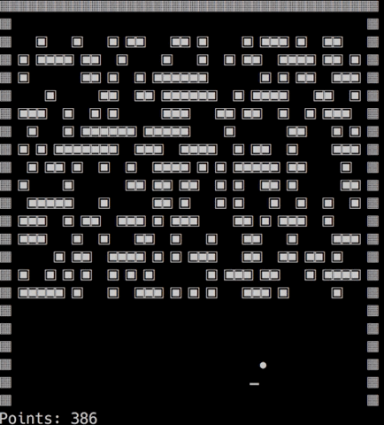
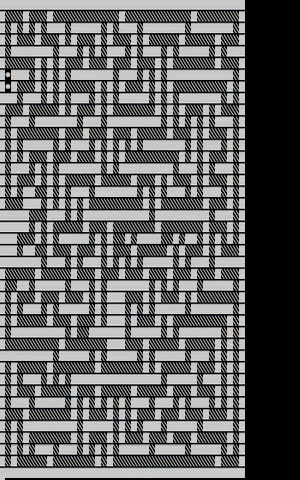

# adventofcode2019
My adventofcode.com solutions for 2019

This year I challenge myself by using C++ as solving language - whenever possible :-)


## Compile

I'm using cmake for the build infrastructure. So run:

```bash
$ cmake -S . -B build
$ cd build
$ make
```

As always, it's a lot of work, and a lot of fun! I draw my hat before [Eric Wastl](http://was.tl/). The
puzzles are challenging, well-prepared and creative.

## Diary

### Day 1

Simple one, for preparing my dev env and implement some basic libs like parsing files etc.
A bit of looping, a simple recursive algorithm.

### Day 2

Introduction of the Intcode processor - Implement a basic processor-in-software (a little VM) that
can execute some few Opcodes like adding numbers and addressing memory.

It turns out that this Intcode processor is used in many more riddles. Doing it right the first time
pays off :-)

### Day 3

Find intersections and run length of twisted cables. I solved it by just storing the begin / end points
of each cable segment, and calculate the intersections while laying them out - at the same time
calculating the distance.

My solutions needs very less memory, as it does not store all the cable "points", but just the start/end coordinates.


### Day 4

Crack a password by iterating through numbers and follow the rules - easy, I count them up as numbers and
parse them by converting to strings.

### Day 5

Intcode processor enhancements - This one took a while, until I had it all correct. A lot of fiddling with
direct / indirect memory addressing, but in the end a solid Intcode VM evolved that can execute
something like a very simple Assembler language. That was fun!

### Day 6

Orbital Traversal - In the end, a Tree data structure that needed to be traversed and intersection to be found.

My first attempt to build it as a tree was the right decision, and I solved it in about an hour.

### Day 7

Intcode VM again - This time with multiple instances and some in-/output fiddling. The Intcode processor of mine
needed some adaption to fetch input values, and stop the VM execution on output values (so that I can process them).

It feels a bit like interrupts: The VM stops on a specific event (here, data output), and after the interrupt routine
did its job (my main program), the VM starts executing again.

The first part was easy, but the 2nd part took me a while until everything was in place correctly.

### Day 8

That was a simple one - calculate an image by x/y/z (layers) coordinates. In the end, an ASCII art showed the
solution for the 2nd part. I decided to create a png image, and found the C++ library "CImg" as a very simple solution.

That was a fun riddle, and I learned how to create images in C++ and to add an external library.

### Day 9

Intcode Processor again - some more Opcodes for processing relative memory addresses. My little VM evolves,
and it't really impressive what it can already do.

I also changed the memory model to use the C++ Boost Library's cpp_int, an arbitary size integer class, to support
(very9 large numbers and (very) large memory addresses.

Learned to implement the Boos library, which is painless.

### Day 10

This problem turned out as a geometry problem - calculating angles and beams. In the end, it was easy,
but again, fiddling until everything was correct took some time.

The 2nd part was easy, once I built an angle map with a list of the corresponding planets.

### Day 11

That was a fun one - The Intcode processor was being used to solve a somewhat "real-world" problem -
steering a robot with directions (inputs) and feedback (output).

I also created an ascii art and image output for that one.

### Day 12

That was a hard one - My first attempt tried to find the LCM for the coordinates of a single planet -
How many "rounds" will it take for the x,y,z coordinate to repeat - Then find the LCM for all the planets.

This turned out to be completely wrong, and it took me some hours and a lot of nerves.

The final solution was not so hard - Just look at the single axis for ALL planets together (how long does it take
until all the X-positions are back at square one, then x, z), and take the LCM for the 3 separate values. Phew!

### Day 13

Play Breakout! That one was really funny! The Intcode processor is being used to play a game of Breakout.
One has to give Joystick commands (input), and the Intcode program draws the (changed) play field blocks (output).

I decided to give inputs to the Intcode program whenever it asks for: I created a function that is called by the
Intcode processor when the program requests an input - The function then checks if the paddle need to be moved to the left
or right, depending on the current ball position. That turned out to be a very wise decision.

Watch my final solution:

<figure>

<figcaption>Day 13 - Solution in action</figcaption>
</figure>

### Day 14

I found that one hard - The first part was some recursive lookups with some bookkeeping, while the 2nd part
could easily be solved with a Binary Search algorithm.

It turned out that my first part solution was WAY too slow - I have too many recursive lookups in there somewere.
I brute-forced the 2nd part with it anyway, but took hours - Other solutions ran in miliseconds. I did not find the
error until today.


### Day 15

A classical Backtrack problem - Map an unknown maze, and traverse it.

The first part was more trickier this time: It was not enough to just find the Oxygen (the maze target), but you
had to continue to map the whole maze - This is needed for the 2nd part.

The backtrack algorithm took me a while until I did everything correctly - in the end it was staight forward, but took
a lot of fiddling, outputting, debugging.

After part 1 was done, I could finally draw the map on the screen, just for fun :-)

For Part 2 I took another approach: I started at the one Oxygen tile, built a "future" oxygen list to be processed,
and processed them round for round until no more oxygen needed to be created.

The key for the 2nd part was the proper mapping in part 1. This made the 2nd part a lot easier. Watch the oxygen
distribution live:

<figure>

<figcaption>Day 15 - Solution in action</figcaption>
</figure>

### Day 16

This is the first time I don't finish both puzzles.

Part 1 was pretty straight forward, and I did it in the realization that it *might* be
not an optimal approach for the 2nd part, as I guessed would be some magnitues
longer to process...

And so it was :-)) It was just not possible to use the brute force approach on the 2nd part.
So there need to be some kind of pattern in how the numbers will change over time.

I just did not get it. Afer reading some of the subreddit entries, I just came to the conclusion
that I never would have found out that by myself, so I let the 2nd part unresolved...

Sad...
